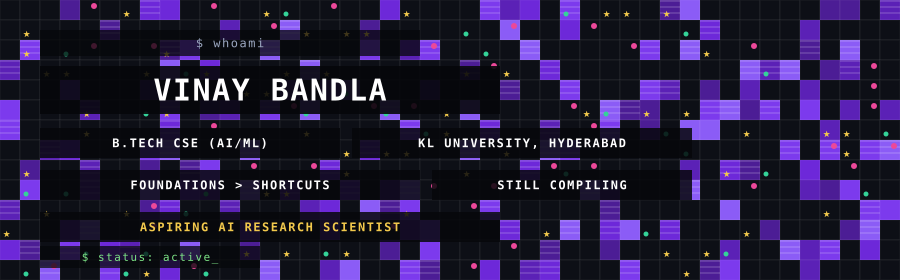
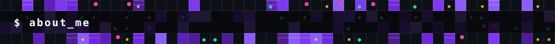
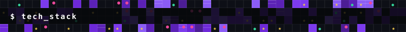
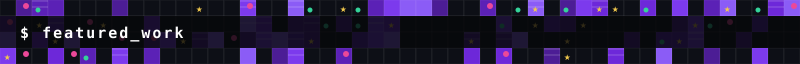
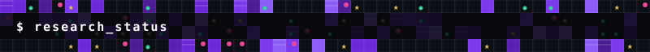
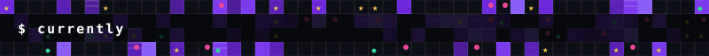
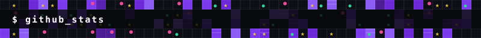

 

I'm **Vinay** — a Computer Science (AI/ML) undergrad at **KL University, Hyderabad**. My coursework spans CSE core, ECE/IoT, and ML tracks.

I'm not trying to collect frameworks for a badge wall. I'm trying to understand what's actually happening under the hood of the systems everyone's calling "AI" — the math, the training loops, the architectures — not just the `import` statement. My long-term goal is to work as an **AI Research Scientist** at a frontier AI lab. That's the destination, not a job title I'm claiming yet — I'm still on the road, building the foundations to get there.

Right now that looks like: real projects (some finished, some mid-build), coursework I take seriously, hackathons I show up to, and one half-formed research idea I keep circling back to.

 

**Actually building with** — tools I use hands-on, in projects, in coursework, day to day:

**Also in active use:** NumPy · Node.js · REST API design & consumption · PyCharm · yt-dlp-based media pipelines · Wokwi (embedded simulation)

**Currently learning / experimenting with** — not claiming mastery, this is the hands-dirty list: PyTorch, TensorFlow/JAX, Transformer architectures, Reinforcement Learning, LLM experimentation, RAG pipelines, and the underlying math — linear algebra, probability & statistics, ML theory. I work through Deep-ML problems regularly to force concept → code translation instead of copy-pasting solutions.

 

Real projects. Real status. No inflated numbers.

<table>
<tr>
<td width="50%" valign="top">

### CAS — Citation Analysis System
My DSA-3 course project. Built against a full 12-phase build plan including a web delivery layer, shipped in phases via direct GitHub pushes.

**Status:** `319/319 tests passing`

</td>
<td width="50%" valign="top">

### Eye of Odin
Hackathon build — a campus lost-and-found tracker using CLIP embeddings + cosine similarity for visual matching. FastAPI/SQLite/SQLAlchemy backend, Norse-mythology-themed README.

**Status:** `20/20 tests passing`

</td>
</tr>
<tr>
<td width="50%" valign="top">

### Stream_Press
A yt-dlp-based media extraction app built in FastAPI + vanilla JS. Fixed platform-specific extraction bugs across Facebook, Reddit, Vimeo, Twitch, and Dailymotion.

**Milestone:** my first GitHub pull request, made with guidance.

</td>
<td width="50%" valign="top">

### BLOCKHACK 2026
Algorand / AlgoKit / x402 hackathon at KLH Bachupally. Set up a full WSL2 AlgoKit dev environment and worked through security triage on an x402 implementation.

</td>
</tr>
</table>

 

I want to be upfront about what stage this is at: **exploration and drafting**, not peer-reviewed output.

- **Tensor-network compression for illumination-robust CV** — a research paper *concept* I'm developing, combining quantum-inspired tensor network compression (currently pivoted toward Tensor-Train/Ring methods) with computer vision robustness under variable lighting. Still shaping the framing, not written up.
- **Review paper — "A Review of Technology Developments in Self-Evolving AI Agents"** — prepared for academic submission: structural editing, citation fixes, Springer Nature formatting. Submission-track, not a publication yet.
- **DAS-HDPP** — a theoretical transformer-augmentation framework I sketched out, drawing from general relativity and nonlinear optics concepts. Early-stage and speculative — a thinking exercise, not a validated architecture.

 

Coursework and deliverables I'm actively grinding through: an **IoT project** (pivoted from STM32 Blue Pill to Industrial Sensor Monitoring with ESP32-S3, prototyping in Wokwi), **DSA-2 Java case studies**, an **ML course project** (multinomial logistic regression for match prediction), and a **multi-agent competitive resource-allocation game** built for a CFAI mini-project viva.

I also run a personal multi-agent workflow — Claude, ChatGPT, Antigravity, and DeepSeek — where each tool is scoped to a specific role rather than used interchangeably.

 

 

**→ [play with the live interactive version of this grid ↗](https://claude.ai/artifact/2rP2Je65vtNCJbhoZWSzPN)**

Undergrad years, spent building foundations — not shortcuts.

